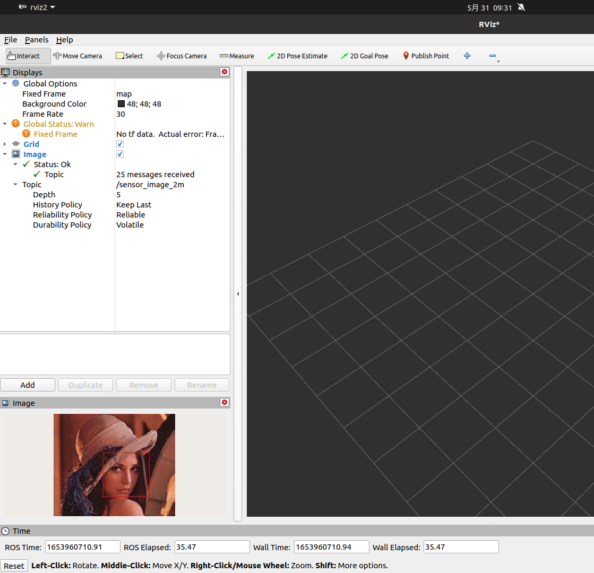
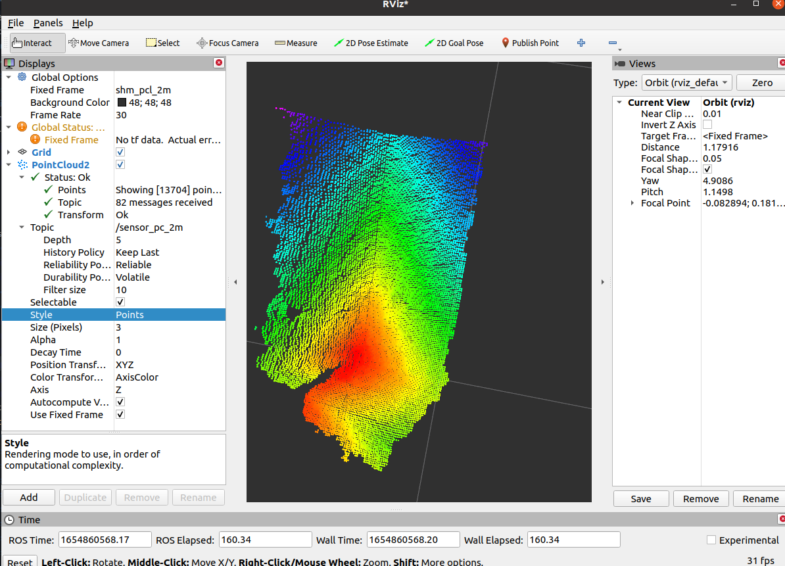

# ros2_shm_msgs

fou Chinese reader please refer [简体中文](./README_cn.md)

## introduction

### motivation

Zero copy can save times of copy in IPC, thus reduces cpu usage and transport latency, which can be used in time-critical systems or resource-constrained computing platforms.

For intra-process context, the zero copy can be achieved with [rclcpp intra-process communication](https://docs.ros.org/en/rolling/Tutorials/Demos/Intra-Process-Communication.html), which is avaiable since dashing.

For zero-copy with inter-process-communication in ros2, there's loaned-api provided since ros2-foxy, see [ros2_design: Zero Copy via Loaned Messages](https://design.ros2.org/articles/zero_copy.html)

### related work

- [ros2_shm_vision_demo: Demonstrate how to use shared memory with image processing algorithms.](https://github.com/MatthiasKillat/ros2_shm_vision_demo)
- [ros2_shm_demo by ApexAI: demonstrates how to use zero-copy Shared Memory data transfer in ROS 2 with CycloneDDS](https://github.com/ApexAI/ros2_shm_demo)

### what ros2_shm_msgs do

This repo is inspired by projects above, with providing unified image and pointcloud2 msg definition, type conversion function, rviz bridge, and demos with performance test, in a scalable way to have a good support to true zero copy transportation in IPC(intra-machine, inter-process) context.

### application status

Currently tested in ros2 galactic with the following layers:

- rmw_cyclonedds_cpp
  - cyclonedds(0.8.x)+iceoryx(1.0.x)
- rmw_fastrtps_cpp
  - fastdds(>=2.3.x)

the performance of zero copy can be seen in [ros2_jetson_benchmarks](https://github.com/ZhenshengLee/ros2_jetson_benchmarks), which is tested within [GitHub - ZhenshengLee/performance_test: Github repo for apex.ai performance_test for more middlewares](https://github.com/ZhenshengLee/performance_test).

this lib has been used in [the custom version of ros2_v4l2_camera](https://github.com/ZhenshengLee/ros2_v4l2_camera) and [the custom version of rslidar_sdk](https://github.com/ros2driver/rslidar_sdk/tree/outdoor/dev_opt_shm), and the performance improvement is awesome!

For example, in my pc of dell 3630, the zero-copy transport of a shm_msgs::msg::Image1m can save about 80% of transport time, from 1.4ms to 0.3ms.
## design

### software components

this package includes ros2 msg definitions and demos that supports the msgs.

- shm_msgs::msg::PointCloud8k
- shm_msgs::msg::Image8k
- PointCloud2Modifier8k
- open3d_conversions
- opencv_conversions
- pcl_conversions
- shm_pcl_bridge
- shm_image_bridge
- shm_open3d_bridge

### development status

pointcloud and image are currently supported.

|  feature              | Status                             |
|-----------------------|------------------------------------|
| pointcloud8k          | :heavy_check_mark:                 |
| pointcloud512k        | :heavy_check_mark:                 |
| pointcloud1m          | :heavy_check_mark:                 |
| pointcloud2m          | :heavy_check_mark:                 |
| pointcloud4m          | :heavy_check_mark:                 |
| pointcloud8m          | :heavy_check_mark:                 |
| image8k               | :heavy_check_mark:                 |
| image512k             | :heavy_check_mark:                 |
| image1m               | :heavy_check_mark:                 |
| image2m               | :heavy_check_mark:                 |
| image4m               | :heavy_check_mark:                 |
| image8m               | :heavy_check_mark:                 |
| open3d_conversions    | :heavy_check_mark:                 |
| opencv_conversions    | :heavy_check_mark:                 |
| pcl_conversions       | :heavy_check_mark:                 |
| shm_image_bridge      | :heavy_check_mark:                 |
| shm_open3d_bridge     | :heavy_check_mark:                 |
| shm_pcl_bridge        | :heavy_check_mark:                 |

## demo

### select rmw

for rmw_cyclonedds

```sh
export RMW_IMPLEMENTATION=rmw_cyclonedds_cpp
export CYCLONEDDS_URI=file:///$HOME/shm_cyclonedds.xml

# t0
iox-roudi
```

for rmw_fastrtps_cpp

```sh
export RMW_IMPLEMENTATION=rmw_fastrtps_cpp
export FASTRTPS_DEFAULT_PROFILES_FILE=$HOME/shm_fastdds.xml
export RMW_FASTRTPS_USE_QOS_FROM_XML=1
```

### check if zero copy

for rmw_cyclonedds_cpp

```sh
iox-introspection-client --all
# to check if iceoryx_rt process has been created
```

for rmw_fastrtps_cpp, to check if there is fastdds shm file being created

```sh
# check if shm-transport
ls /dev/shm/fastrtps_
# check if data-sharing
ls /dev/shm/fast_datasharing*
```

### shm_image examples

#### run image talker and listener

```sh
# t1
cd ./install/shm_msgs/lib/shm_msgs/
./image1m_talker

# t2
cd ./install/shm_msgs/lib/shm_msgs/
./image1m_listener
```

#### run bridge and rviz2

```sh
# configure topic remapping
ros2 launch shm_msgs shm_image_bridge.launch.py
```

to check the msg flow and visualize the msg




### shm_pcl example

#### run pcl talker and listener

```sh
# t1
cd ./install/shm_msgs/lib/shm_msgs/
./pcl2m_talker

# t2
cd ./install/shm_msgs/lib/shm_msgs/
./pcl2m_listener
```

#### run bridge and rviz2

```sh
# configure topic remapping
ros2 launch shm_msgs shm_pcl_bridge.launch.py
```

to check the msg flow and visualize the msg




### shm_open3d example

#### run open3d talker and listener

```sh
# t1
cd ./install/shm_msgs/lib/shm_msgs/
./open3d2m_talker

# t2
cd ./install/shm_msgs/lib/shm_msgs/
./open3d2m_listener
```

## discussions

Comments have been given from github and ros2 community.

- [2021 08 05 Eclipse iceoryx developer meetup](https://github.com/eclipse-iceoryx/iceoryx/wiki/2021-08-05-Eclipse-iceoryx-developer-meetup)
- [ros discourse about z copy with cycloedds and iceoryx](https://discourse.ros.org/t/talk-usingzero-copy-data-transfer-in-ros-2/21448/13)
- [ros discourse about using zero copy with ros2_shm_msgs](https://discourse.ros.org/t/using-zero-copy-transport-in-ros2-with-ros2-shm-msgs/26226)
- [autoware.auto issue: Enable zero-copy for pointcloud processing](https://gitlab.com/autowarefoundation/autoware.auto/AutowareAuto/-/issues/1096)
- [image_common issue: Use loaned messages to optimize the performance for image transport](https://github.com/ros-perception/image_common/issues/216)
- [realsense-ros issue: Zero-copy point cloud subscriber in ROS2](https://github.com/IntelRealSense/realsense-ros/issues/2353)

Feel free to create issues in the repo.

## Basics

### zero copy

Zero_copy is a transport layer to get a better performance especially when payload size exceeds 64k.

Please refer [Using_Zero_Copy_In_ROS2.pdf](./doc/Using_Zero_Copy_In_ROS2.pdf) for more info of concept of z copy.

In short, zero copy needs api support through all software layers.

For CycloneDDS, see [doc from cyclonedds](https://github.com/eclipse-cyclonedds/cyclonedds/blob/master/docs/manual/shared_memory.rst) and [doc from rmw_cyclonedds](https://github.com/ros2/rmw_cyclonedds/blob/master/shared_memory_support.md) for details

For FastDDS, see [doc from fastdds](https://fast-dds.docs.eprosima.com/en/latest/fastdds/use_cases/zero_copy/zero_copy.html) and [doc from rmw_cyclonedds](https://fast-dds.docs.eprosima.com/en/latest/fastdds/ros2/ros2.html)

### minimum copy

Without fixed-length msg, a serialization is needed before IPC, so copy can not be avoided.

But time of copy can still be reduced comparing to Loopback Network Communication(such as udp multicast), which is the default transport layer in most cases of dds.

Performance can still be improved with minimum copy.

### dds involved

The [eCAL](https://continental.github.io/ecal/) by Continental provides iceoryx transport layer to get true zero copy, but extra cmake based compilation is needed.

refer [The performance of eCAL](https://continental.github.io/ecal/advanced/performance.html), and [Enable ECAL_LAYER_ICEORYX](https://continental.github.io/ecal/development/ecal_cmake_options.html) for more details.

eCAL also provides default shm based transport layer to get minimum copy performance, see [this issue](https://github.com/continental/ecal/issues/326) for details.

Cyclonedds and eCAL both use iceoryx as the z copy transport layer.

Iceoryx alos provide direct access to rmw, see [rmw_iceoryx](https://github.com/ros2/rmw_iceoryx) for details.

FastDDS provide zero-copy since v2.2, so with rmw_fastrtps the loaned-api canbe used since ros2-galactic.

## acknowledgement

- [Iceoryx](https://iceoryx.io/)
- [Apex.AI](http://apex.ai/)
- [CycloneDDS](https://www.adlinktech.com/en/CycloneDDS)
- [eCAL](http://ecal.io/)

## Q&A

todo.
